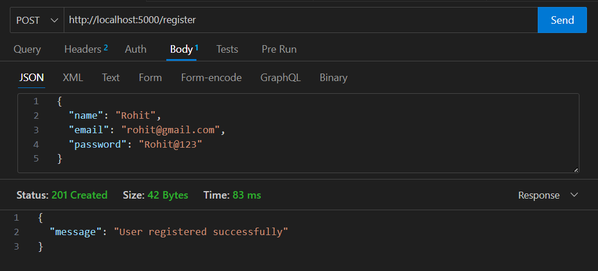
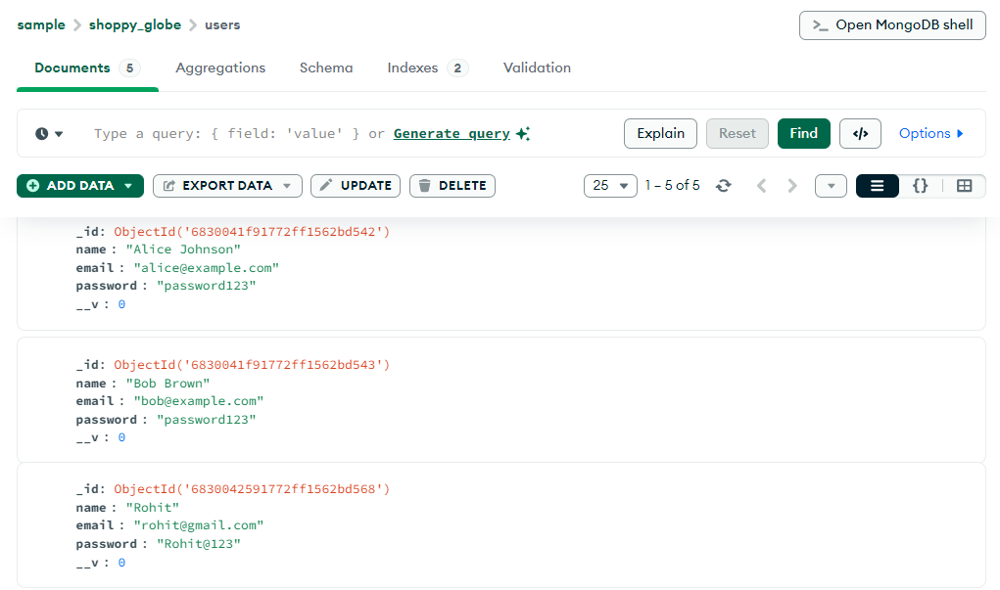

 **Shoppy Globe Backend**

# 🛒 Shoppy Globe Backend

This is the backend server for **Shoppy Globe**, a mock e-commerce platform. It provides RESTful APIs for user authentication, product listing, and cart management. This project uses **Node.js**, **Express**, **MongoDB**, and **JWT** for secure access.

---

## 🚀 Features

- ✅ User Registration & Login with JWT Authentication
- 📦 Insert dummy products and users on startup
- 🛒 Cart operations (Add, Update Quantity, Remove)
- 🔐 Protected routes using token-based validation
- 🌐 RESTful API design with Express.js
- 🗑️ Database cleared on server restart (to prevent duplicate entries)

---

## 🧰 Tech Stack

- **Backend**: Node.js, Express.js
- **Database**: MongoDB, Mongoose
- **Authentication**: JSON Web Tokens (JWT)
- **Middleware**: Custom authentication middleware
- **Environment**: ES6 Modules, `express.json()`

---

## 📁 Project Structure

```

shoppy\_globe\_backend/
├── controllers/
│   ├── userController.js
│   └── productController.js
├── models/
│   ├── User.js
│   ├── Product.js
│   └── Cart.js
├── server.js
├── db.js
└── package.json

````

---

## ⚙️ Getting Started

### 1️⃣ Clone the repository

```bash
git clone https://github.com/yourusername/shoppy_globe_backend.git
cd shoppy_globe_backend
````

### 2️⃣ Install dependencies

```bash
npm install
```

### 3️⃣ Set up environment variables

No `.env` is used in the current setup, but JWT secret is hardcoded:

```js
const JWT_SECRET = 'wrtcgunh3475yns2345mz92';
```

🔐 You may move this to a `.env` file for better security in production.

### 4️⃣ Start the MongoDB server

Make sure MongoDB is running on `mongodb://localhost:27017`.

### 5️⃣ Run the server

```bash
node server.js
```

On startup:

* Connects to MongoDB
* Deletes existing users, products, and cart data
* Inserts dummy users and products

---

## 🔐 Authentication

JWT token must be provided in the `Authorization` header for protected routes:

```
Authorization: Bearer <token>
```

---

## 📦 API Endpoints

### 🧑‍💻 Auth Routes

| Method | Endpoint    | Description              |
| ------ | ----------- | ------------------------ |
| POST   | `/register` | Register new user        |
| POST   | `/login`    | Login user and get token |

---

### 🛍️ Product Routes

| Method | Endpoint        | Description       |
| ------ | --------------- | ----------------- |
| GET    | `/products`     | Get all products  |
| GET    | `/products/:id` | Get product by ID |

---

### 🛒 Cart Routes (Protected)

| Method | Endpoint           | Description             |
| ------ | ------------------ | ----------------------- |
| POST   | `/cart`            | Add product to cart     |
| PUT    | `/cart/:productId` | Update quantity in cart |
| DELETE | `/cart/:productId` | Remove item from cart   |

---

## Test Results Of All the API end points

### POST /register

#### Thunder Client Result


#### MongoDB Result


---

## ⚠️ Notes

* This project is for **educational/demonstration** purposes.
* All data is reset each time the server is restarted.
* Consider replacing dummy data initialization in production.

---

## 📜 License

This project is licensed under the **MIT License**.

---

## ✍️ Author

Made with 💻 by [Your Name](https://github.com/yourusername)

```

Let me know if you'd like:
- Dummy data description
- Postman collection
- Docker support
- `.env`-based configuration
- Instructions for deployment on services like Railway, Render, or Vercel backend

I can add any of those as well.
```
